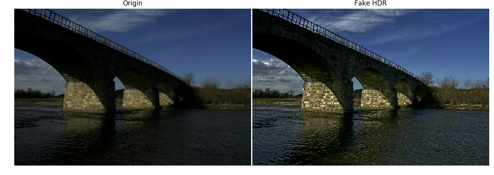
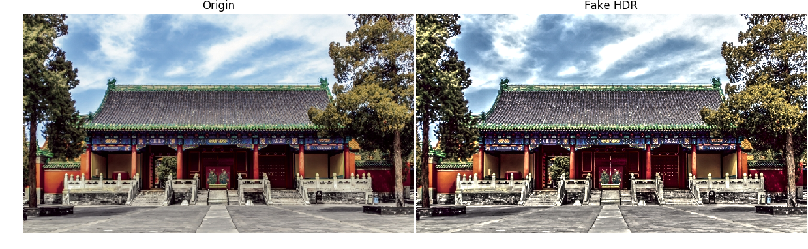

# singleLDR2HDR
An implementation of generating high dynamic range image from single low dynamic range image.  
## Experiment Result 





## Attention
Resolution of input image should not be too large(it depends on your machine's memory) since using SciPy to solve a large scale linear system may cause memory exhausted. 

## Setup
Tested on Python3.5 and Python2.7.
### Dependencies
Install denpendencies. 
```
cd singleLDR2HDR
pip install -r requirements.txt
```
Usage:
```
python run.py ./test_image/test1.jpg
```

## Reference
[1][Generation of High Dynamic Range Illumination from a Single Image for the Enhancement of Undesirably Illuminated Images](https://arxiv.org/abs/1708.00636?context=cs)
